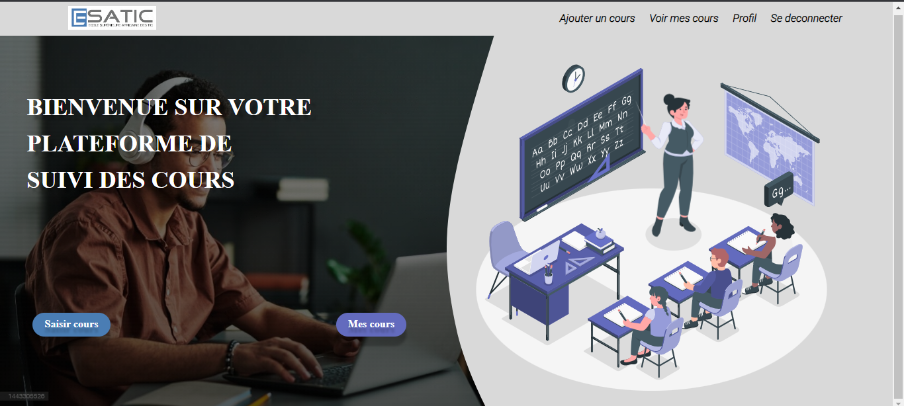

# Cahier de texte pour enseignants

Bienvenue dans le projet "Cahier de texte pour enseignants" ! Ce projet vise à faciliter la gestion des cours et des emplois du temps pour les enseignants en utilisant PHP. Il offre une plateforme conviviale où les enseignants peuvent ajouter leurs cours, consulter leur historique de cours et les administrateurs peuvent gérer les enseignants et visualiser les cours de tous les enseignants, triés par classe.

## Fonctionnalités principales

Le projet "Cahier de texte pour enseignants" offre les fonctionnalités suivantes :

### Pour les enseignants
- Ajouter des cours : Les enseignants peuvent ajouter des cours en spécifiant la date, l'heure, le titre et la description du cours.
- Consulter les cours : Les enseignants peuvent consulter leur historique de cours et afficher les détails de chaque cours effectué.

### Pour les administrateurs
- Ajouter un enseignant : Les administrateurs ont la possibilité d'ajouter de nouveaux enseignants en fournissant leurs informations personnelles, telles que le nom, l'adresse e-mail et le numéro de téléphone.
- Visualiser les cours des enseignants : Les administrateurs peuvent visualiser tous les cours effectués par les enseignants, triés par classe. Cela permet une gestion efficace des cours et des emplois du temps.
